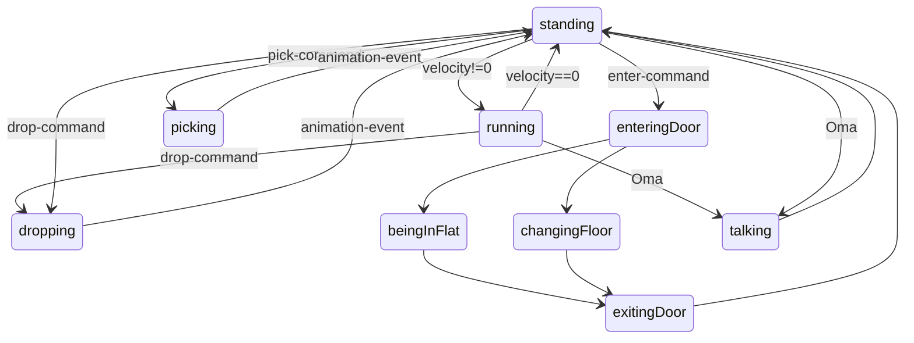

# States

Hier eine Übersicht über States, etc.

## States Bewohner

- running
- standing
- picking
- dropping
- changingFloor
- enteringDoor
- exitingDoor
- beingInFlat
- talking

### dropping

1. Ist Müll vorhanden?
2. Darf man ihn platzieren?

### picking

1. Bin ich auf Müll?
2. Kann ich noch Müll tragen?

### enteringDoor

1. Ist hier eine Tür?
2. Staircase oder Flat?
3. Falls Staircase: Wie nach oben oder unten kommen?

### talking

1. Wie lange?
2. Abbrechen?

### beingInFlat

1. Wie lange? -> Timer

## Variablenbenennung

Grundsätzlich: Überall Typen angeben, auch Rückgabewerte mit Typen

* classes: PascalCase
* functions: Verb-Anfang (get, set, is, calculate), lowercase + Unterstrich
* private function: Unterstrich am Anfang
* event-function: on-Anfang
* booleans: b + Is, camelCase (bIsOnStairs)
* states & Animationen: Verlaufsform von Verben
* constants: UPPERCASE + Unterstrich(underscore)
* arrays: a + Plural, camelCase (aTrashBags)
* integer: i + Name, camelCase (iTrashAmount)
* float: f + Name, camelCase (fStairRandom)
* vector2: v + Name, camelCase (vBewohnerVelocity)
* dicts: d + Name, camelCase (dBewohner)
* signals: Geschehenes + Verb in Partizip II (trash_collected)