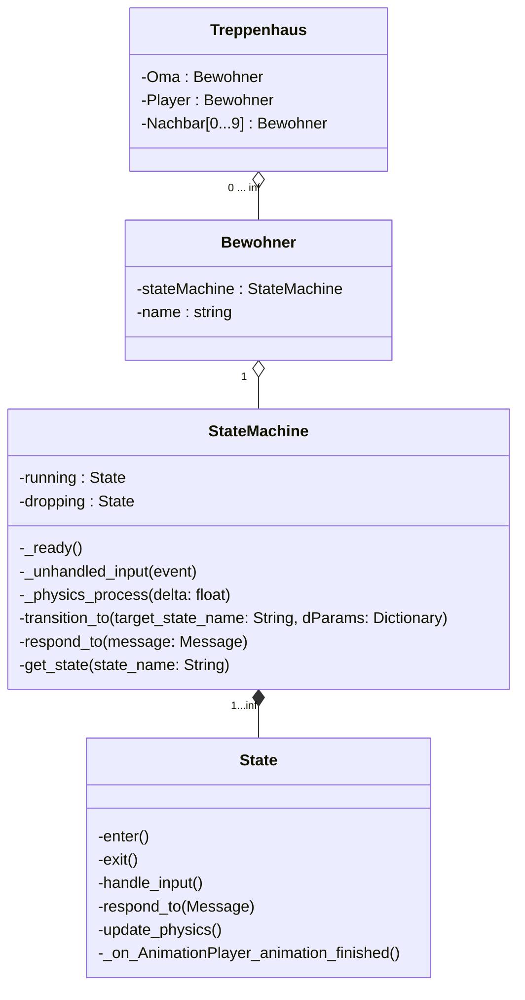

```mermaid
classDiagram
direction TB
  class Treppenhaus {
    -Oma : Bewohner
    -Player : Bewohner
    -Nachbar[0...9] : Bewohner
  }
  class Bewohner{
    -stateMachine : StateMachine
    -name : string
  }
  class StateMachine{
    -running : State
    -dropping : State
    -_ready()
    -_unhandled_input(event)
    -_physics_process(delta: float)
    -transition_to(target_state_name: String, dParams: Dictionary)
    -respond_to(message: Message)
    -get_state(state_name: String)
  }
  class State{
      -enter()
      -exit()
      -handle_input()
      -respond_to(Message)
      -update_physics()
      -_on_AnimationPlayer_animation_finished()
  }
  Treppenhaus "0 ... inf" o-- Bewohner
  Bewohner "1" o-- StateMachine
  StateMachine "1...inf" *-- State
```